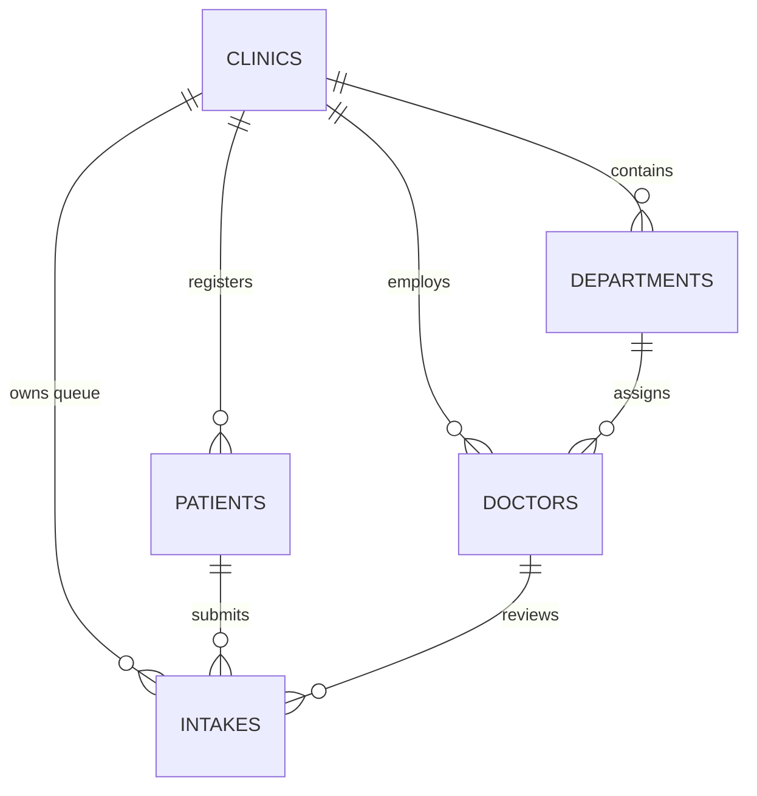

# VaidyaDrishti — Complete Production Database Schema & Live Rows

Generated on: 15/8/2026, 11:24:40 pm (IST)

---

## 1. Database Entity-Relationship Architecture

---

## 2. Table Schemas & Live Rows

### 🏥 2.1 Table: `clinics`
**Description**: Stores medical centers, OPDs, and hospital facilities.

| ID | Name | Code | Address | Created At |
| :--- | :--- | :--- | :--- | :--- |
| `00000000-0000-0000-0000-000000000001` | **VaidyaDrishti Pilot Clinic #1** | `PILOT_CLINIC_1` | Primary Health Centre, Rural District | 2026-08-12T08:58:12.088304+00:00 |
| `00000000-0000-0000-0000-000000000011` | **Jawaharlal Nehru Medical College and Hospital** | `HOSP_JLNMCH` | Choti Khanjarpur, Tilkhamanjhi | 2026-08-13T15:02:09.019996+00:00 |
| `00000000-0000-0000-0000-000000000022` | **Healing Touch Hospital** | `HOSP_HealingTouch` | Tilkhamanjhi Chowkh, Near Sandish | 2026-08-13T15:02:09.019996+00:00 |
| `00000000-0000-0000-0000-000000000033` | **Dr Vinay Krishna Clinic** | `CLINIC_VinayKrishna` | Radha Rani Sinha Road, Near Navyug Vidyalaya | 2026-08-13T15:02:09.019996+00:00 |
| `00000000-0000-0000-0000-000000000044` | **Dr. R B JHA** | `CLINIC_ORTHO` | Hanuman Nagar, OPD Complex | 2026-08-13T15:02:09.019996+00:00 |
| `00000000-0000-0000-0000-000000000055` | **Netralaya Clinic (Dr Sanjay Sharma)** | `CLINIC_EYES` | Ghantaghar, Near Christ Church | 2026-08-13T15:02:09.019996+00:00 |

### 🏢 2.2 Table: `departments`
**Description**: Stores specialty units within hospitals (e.g. General Medicine, Orthopedics, Eye OPD).

| ID | Clinic ID | Department Name | Code | Created At |
| :--- | :--- | :--- | :--- | :--- |
| `10000000-0000-0000-0000-000000000001` | `undefined` | **Cardiology** | `DEPT_JLNMCH_CARDIO` | 2026-08-13T15:02:09.019996+00:00 |
| `10000000-0000-0000-0000-000000000002` | `undefined` | **Orthopedics** | `DEPT_JLNMCH_ORTHO` | 2026-08-13T15:02:09.019996+00:00 |
| `20000000-0000-0000-0000-000000000003` | `undefined` | **General Medicine** | `DEPT_HealingTouch_GENMED` | 2026-08-13T15:02:09.019996+00:00 |
| `20000000-0000-0000-0000-000000000004` | `undefined` | **Pediatrics** | `DEPT_HealingTouch_PEDIA` | 2026-08-13T15:02:09.019996+00:00 |

### 👨‍⚕️ 2.3 Table: `doctors`
**Description**: Registered Medical Practitioner (RMP) credentials and assigned clinics under TPG 2020.

| ID | Doctor Name | Email | RMP License | Clinic ID | Department ID | Role | Qualifications |
| :--- | :--- | :--- | :--- | :--- | :--- | :--- | :--- |
| `03a9ad75-bc8c-45ff-a7bd-82c1dd206874` | **Dr. Ramesh Chandra (RMP)** | `doctor@vaidyadrishti.com` | `VERIFIED-RMP` | `00000000-0000-0000-0000-000000000001` | `None` | `doctor` | MBBS, MD |
| `150812fc-66d7-4b3c-a774-579b72f6f2b4` | **Dr. Vinay Krishna** | `dr.vinaykrishna@vaidyadrishti.com` | `RMP-IND-2026-99` | `00000000-0000-0000-0000-000000000033` | `None` | `doctor` | MBBS, MD |
| `ba07e6fb-f114-4c0c-808f-bf448617c47b` | **Dr. Sanjay Sharma** | `dr.sanjaysharma@vaidyadrishti.com` | `RMP-IND-2026-100` | `00000000-0000-0000-0000-000000000055` | `None` | `doctor` | MBBS, MD |
| `a4f2dc10-3fef-466e-ba9c-4df70da014cb` | **Dr. Ankit** | `dr.ankit@vaidyadrishti.com` | `RMP-ORTHO-202` | `00000000-0000-0000-0000-000000000011` | `10000000-0000-0000-0000-000000000002` | `doctor` | MBBS, MD |
| `7d7b555e-01e0-4a56-9992-48f914b21b2e` | **Dr. Kriti Sharma** | `dr.kritisharma@vaidyadrishti.com` | `RMP-GENMED-201` | `00000000-0000-0000-0000-000000000022` | `20000000-0000-0000-0000-000000000003` | `doctor` | MBBS, MD |

### 👤 2.4 Table: `patients`
**Description**: Patient demographics registered via WhatsApp or Web Intake Portal under DPDP Act 2023.

| ID | Full Name | Age | Sex | Phone | Clinic ID | Registered At |
| :--- | :--- | :--- | :--- | :--- | :--- | :--- |
| `a657fd38-3ec3-41a6-b88f-9a3c549eca29` | **Rajesh Sharma** | 58 yrs | Male | `9811223344` | `00000000-0000-0000-0000-000000000001` | 2026-08-10T11:52:11.103574+00:00 |
| `88b3dcad-eff7-4d44-8b41-52a04f2ef32d` | **Savitri Devi** | 64 yrs | Male | `9822334455` | `00000000-0000-0000-0000-000000000001` | 2026-08-10T11:52:11.954402+00:00 |
| `75d94a91-1ba5-4087-b613-b8abe091f221` | **Amit Patel** | 32 yrs | Male | `9833445566` | `00000000-0000-0000-0000-000000000001` | 2026-08-10T11:52:13.662775+00:00 |
| `5073ffeb-699f-451f-a49a-b6dac70997ad` | **Pooja Verma** | 26 yrs | Male | `9844556677` | `00000000-0000-0000-0000-000000000001` | 2026-08-10T11:52:14.847203+00:00 |
| `76bc0fdf-4420-4be7-98be-538b7c5b5247` | **Aarav (Mother: Priya)** | 0 yrs | Male | `9855667788` | `00000000-0000-0000-0000-000000000001` | 2026-08-10T11:52:15.495334+00:00 |
| `610ab881-1d63-4994-880b-faea194158a5` | **Sunil Kumar** | 40 yrs | Male | `9866778899` | `00000000-0000-0000-0000-000000000001` | 2026-08-10T11:52:16.145938+00:00 |
| `dbceef5e-708c-4aa8-9d0d-7f88a86c2fee` | **Meena Kumari** | 35 yrs | Male | `9877889900` | `00000000-0000-0000-0000-000000000001` | 2026-08-10T11:52:16.735828+00:00 |
| `428be9de-2095-4c58-8c89-1a1509f93b18` | **Karan Singh** | 29 yrs | Male | `9888990011` | `00000000-0000-0000-0000-000000000001` | 2026-08-10T11:52:17.397217+00:00 |
| `a4860f00-f4a2-4250-9f0d-a443b0bde1b0` | **Anita Roy** | 48 yrs | Male | `9899001122` | `00000000-0000-0000-0000-000000000001` | 2026-08-10T11:52:19.149464+00:00 |
| `53f3eff3-43df-41df-b0bb-1b9888e979a6` | **Vikram Joshi** | 22 yrs | Male | `9800112233` | `00000000-0000-0000-0000-000000000001` | 2026-08-10T11:52:19.864491+00:00 |
| `e3bb382d-61d4-4e90-ae1f-f5dc212ca2fd` | **Deepak Yadav** | 50 yrs | Male | `9711223344` | `00000000-0000-0000-0000-000000000001` | 2026-08-10T11:52:20.45644+00:00 |
| `a04412d3-b0be-47ae-946f-b9642a59a071` | **Suman Lata** | 43 yrs | Male | `9722334455` | `00000000-0000-0000-0000-000000000001` | 2026-08-10T11:52:21.168853+00:00 |
| `21369f3d-5211-4198-9337-06d33b85f2b5` | **Rohan Gupta** | 19 yrs | Male | `9733445566` | `00000000-0000-0000-0000-000000000001` | 2026-08-10T11:52:21.945221+00:00 |
| `e6f3fb41-90f4-4227-9d4c-d0b28635d49b` | **Rameshwar Prasad** | 61 yrs | Male | `9744556677` | `00000000-0000-0000-0000-000000000001` | 2026-08-10T11:52:22.602992+00:00 |
| `784bfd4d-e930-45b1-ac03-ee0630089a67` | **Kamla Bai** | 70 yrs | Male | `9755667788` | `00000000-0000-0000-0000-000000000001` | 2026-08-10T11:52:23.455701+00:00 |
| `450509b9-e5f3-4980-b08c-8977e1ab7314` | **Ramesh** | 58 yrs | Male | `4848465487` | `00000000-0000-0000-0000-000000000001` | 2026-08-11T08:42:53.230075+00:00 |
| `ad484e74-a619-476d-bc74-6034a9ac37fc` | **Ayush Kumar** | 21 yrs | Male | `9470422303` | `00000000-0000-0000-0000-000000000022` | 2026-08-13T20:19:02.476708+00:00 |
| `58fa4eca-4bea-415e-8130-d810dad776cb` | **Ashi** | 20 yrs | Male | `8877665544` | `00000000-0000-0000-0000-000000000022` | 2026-08-13T20:24:25.339606+00:00 |
| `59bf79ed-85dd-43bd-8aed-159c99c8c351` | **Nutan** | 46 yrs | Male | `7788443311` | `00000000-0000-0000-0000-000000000022` | 2026-08-14T16:23:06.508741+00:00 |
| `d0ad5c23-b14d-429f-b3fe-64c9154e7412` | **Prachi** | 26 yrs | Male | `+919470422303` | `00000000-0000-0000-0000-000000000001` | 2026-08-15T07:07:31.756117+00:00 |

### 📋 2.5 Table: `intakes`
**Description**: Clinical grievance records, AI triage outputs, and doctor review status.

| Intake ID | Patient ID | Clinic ID | Urgency Level | Status | Red Flags | Raw Text / Voice Transcript | Created At |
| :--- | :--- | :--- | :--- | :--- | :--- | :--- | :--- |
| `bd049944-7113-4ca4-8463-45efd49827ec` | `ad484e74-a619-476d-bc74-6034a9ac37fc` | `00000000-0000-0000-0000-000000000022` | **MEDIUM** | `pending_review` | None | "*Okay, currently I am facing a lot of anxiety. Should I come up to your clinic as...*" | 2026-08-13T20:24:25.527263+00:00 |
| `58f5c258-636e-45aa-89a9-70f4f637886c` | `58fa4eca-4bea-415e-8130-d810dad776cb` | `00000000-0000-0000-0000-000000000022` | **MEDIUM** | `doctor_reviewed` | None | "*I am having a severe headache on one side and I am like facing a lot of cramps a...*" | 2026-08-13T20:22:34.10334+00:00 |

### 📱 2.6 Table: `whatsapp_sessions`
**Description**: Conversation state machine tracking multi-step WhatsApp interactions, timeouts, and draft data.

| Phone | State / Current Step | Status | Clinic ID | Doctor ID | Draft Data | Last Message At |
| :--- | :--- | :--- | :--- | :--- | :--- | :--- |
| `+919470422303` | `SELECT_DEPARTMENT` | `active` | `00000000-0000-0000-0000-000000000001` | `None` | `{"name":"Prachi","age":26}` | 2026-08-15T07:43:25.871+00:00 |
